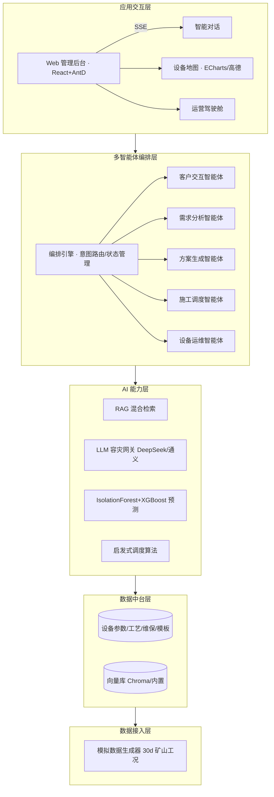
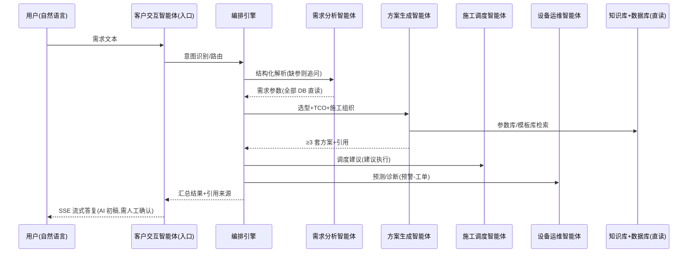

# ICOPS MVP · 系统架构（评审用图）

## 1. 五层技术架构（PRD §5.1 / 指导书 §4.1）



## 2. 多智能体协作时序（演示剧情抽象）



## 3. 部署拓扑（指导书 §8）

```mermaid
graph LR
  U[评审电脑/现场浏览器] -->|HTTP 80/443| C[本地单服务: FastAPI+静态托管 frontend/dist]
  C --> DB[(SQLite data/icops.db)]
  C --> V[(向量库 data/vectorstore)]
  C --> S[(模拟数据 CSV)]
  C -.可选.-> LLM[DeepSeek/通义 API(填 Key 自动启用, 否则离线 demo)]
  C -.可选.-> AMap[高德 JS API(填 AMAP_KEY 后前端启用真实地图)]
```

企业级扩展位（V1.1+）：PostgreSQL/时序库、K8s、Prometheus/Grafana、Milvus、
私有化大模型网关——均已在代码层面留出接口（SQLAlchemy/数据访问层/网关抽象）。
